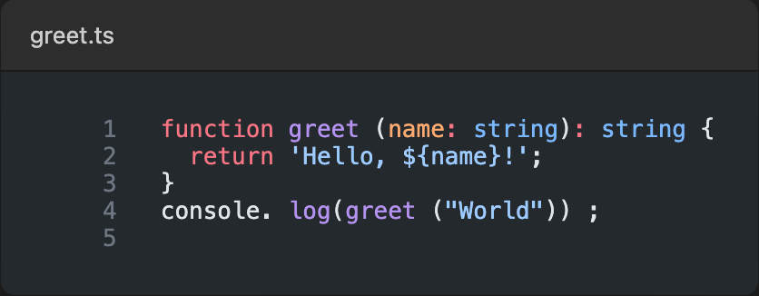

# Shotify

Take beautiful screenshots of code.



## Status

**Implemented:**

- ✅ [`@shotify/core`](https://www.npmjs.com/package/@shotify/core) - Core screenshot generation (HTML/PNG rendering)
- ✅ [`@shotify/cli`](https://www.npmjs.com/package/@shotify/cli) - Command-line interface
- ✅ Emacs integration
- ✅ VS Code extension

**Planned:**

- ⏳ Zed editor integration
- ⏳ Neovim plugin

## Installation

### Install from npm

**CLI Tool (Recommended):**
```bash
npm install -g @shotify/cli
```

**Core Library (for Node.js projects):**
```bash
npm install @shotify/core
```

Verify installation:
```bash
shotify --version
```

### Install from Source

For development or contributing:

1. **Prerequisites:**
   - Node.js 16 or higher
   - pnpm 10.18+ (install via `npm install -g pnpm`)

2. **Clone and build:**
   ```bash
   git clone https://github.com/amackera/shotify.git
   cd shotify
   pnpm install
   pnpm build
   ```

3. **Link CLI globally:**
   ```bash
   cd packages/cli
   pnpm link --global
   ```

## Usage

### Core Package

```typescript
import { renderHtml, renderPng } from '@shotify/core';

// Generate HTML
const html = await renderHtml(code, {
  lang: 'typescript',
  theme: 'github-dark',
  title: 'example.ts',
  showLineNumbers: true,
});

// Generate PNG
const { outPath } = await renderPng(code, {
  lang: 'typescript',
  theme: 'github-dark',
  out: './screenshot.png',
});
```

### CLI

```bash
# Screenshot a file
shotify example.ts -o screenshot.png

# From stdin
echo "console.log('hello')" | shotify --lang js

# Custom options
shotify code.py --theme github-light --title "My Script" --width 1000
```

**Options:**
- `-l, --lang <language>` - Programming language (default: typescript)
- `-t, --theme <theme>` - Color theme (default: github-dark)
- `--title <title>` - Title bar text
- `--line-numbers/--no-line-numbers` - Toggle line numbers
- `--start-line <number>` - Starting line number
- `-w, --width <pixels>` - Screenshot width (default: 800)
- `-p, --padding <value>` - Padding (default: 2rem)
- `-b, --background <color>` - Background color (default: #1e1e1e)
- `-o, --out <path>` - Output file path

### VS Code

**Installation:**

1. Build the extension:
   ```bash
   cd adapters/vscode
   pnpm install
   pnpm run build
   ```

2. Install the extension in VS Code:
   - Option A: Run `pnpm run package` to create a `.vsix` file, then install via VS Code's "Install from VSIX" command
   - Option B: Open the `adapters/vscode` folder in VS Code and press F5 to launch in development mode

**Usage:**

Open the Command Palette (`Cmd+Shift+P` on macOS, `Ctrl+Shift+P` on Windows/Linux) and search for:
- `Shotify: Screenshot Selection` - Screenshot selected code and save to file
- `Shotify: Screenshot File` - Screenshot entire file and save to file
- `Shotify: Screenshot Selection to Clipboard` - Screenshot selected code and copy to clipboard
- `Shotify: Screenshot File to Clipboard` - Screenshot entire file and copy to clipboard

**Configuration:**

```json
{
  "shotify.theme": "github-dark",
  "shotify.width": 800,
  "shotify.showLineNumbers": true,
  "shotify.outputDirectory": "~/Screenshots",
  "shotify.padding": "2rem",
  "shotify.background": "#1e1e1e"
}
```

See [adapters/vscode/README.md](adapters/vscode/README.md) for more details.

### Emacs

**Installation:**

1. Ensure `shotify` CLI is installed (see [Installation](#installation) section above)

2. Add to your Emacs config (`~/.emacs.d/init.el` or `~/.emacs`):
   ```elisp
   (add-to-list 'load-path "/path/to/shotify/adapters/emacs")
   (require 'shotify)

   ;; Optional: bind to a key
   (global-set-key (kbd "C-c s") 'shotify-screenshot)
   ```

3. Restart Emacs or evaluate the configuration

**Usage:**

- `M-x shotify-screenshot` - Screenshot selected region
- `M-x shotify-screenshot-buffer` - Screenshot entire buffer

**Configuration:**

```elisp
;; Path to shotify CLI (default: "shotify")
(setq shotify-cli-path "/custom/path/to/shotify")

;; Theme (default: "github-dark")
(setq shotify-theme "github-light")

;; Screenshot width in pixels (default: 800)
(setq shotify-width 1000)

;; Show line numbers (default: t)
(setq shotify-show-line-numbers nil)

;; Output directory (default: "~/Screenshots")
(setq shotify-output-directory "~/Pictures/Code")
```

See [adapters/emacs/README.md](adapters/emacs/README.md) for more details.

## Available Themes

Shotify uses [Shiki](https://shiki.style) for syntax highlighting, providing access to 55 beautiful bundled themes. You can configure the theme via:
- CLI: `--theme <name>` flag
- VS Code: `shotify.theme` setting
- Emacs: `shotify-theme` variable
- Core API: `theme` option in `renderHtml()` or `renderPng()`

**Popular Themes:**
- `github-dark` (default) - GitHub's dark theme
- `github-light` - GitHub's light theme
- `dracula` - The popular Dracula theme
- `monokai` - Classic Monokai
- `nord` - Arctic, north-bluish color palette
- `tokyo-night` - Clean, dark theme
- `material-theme` - Material Design inspired
- `one-dark-pro` - Atom's iconic One Dark theme

**All Dark Themes:**
`andromeeda`, `aurora-x`, `ayu-dark`, `catppuccin-frappe`, `catppuccin-macchiato`, `catppuccin-mocha`, `dark-plus`, `dracula`, `dracula-soft`, `everforest-dark`, `github-dark`, `github-dark-default`, `github-dark-dimmed`, `github-dark-high-contrast`, `houston`, `kanagawa-dragon`, `kanagawa-wave`, `laserwave`, `material-theme`, `material-theme-darker`, `material-theme-ocean`, `material-theme-palenight`, `min-dark`, `monokai`, `night-owl`, `nord`, `one-dark-pro`, `plastic`, `poimandres`, `red`, `rose-pine`, `rose-pine-moon`, `slack-dark`, `solarized-dark`, `synthwave-84`, `tokyo-night`, `vesper`, `vitesse-black`, `vitesse-dark`

**All Light Themes:**
`catppuccin-latte`, `everforest-light`, `github-light`, `github-light-default`, `github-light-high-contrast`, `kanagawa-lotus`, `light-plus`, `material-theme-lighter`, `min-light`, `one-light`, `rose-pine-dawn`, `slack-ochin`, `snazzy-light`, `solarized-light`, `vitesse-light`

**Preview Themes:**
Visit [shiki.style/themes](https://shiki.style/themes) to preview all themes with live code examples.

## Development

```bash
# Build all packages
pnpm build

# Watch mode
pnpm dev

# Test core package
cd packages/core && pnpm test
```
